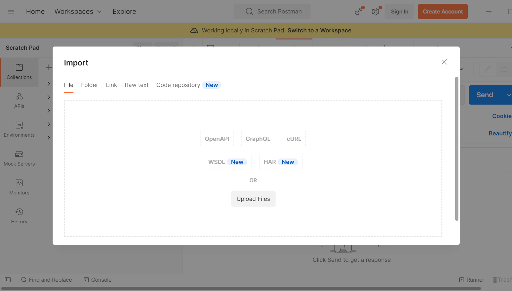
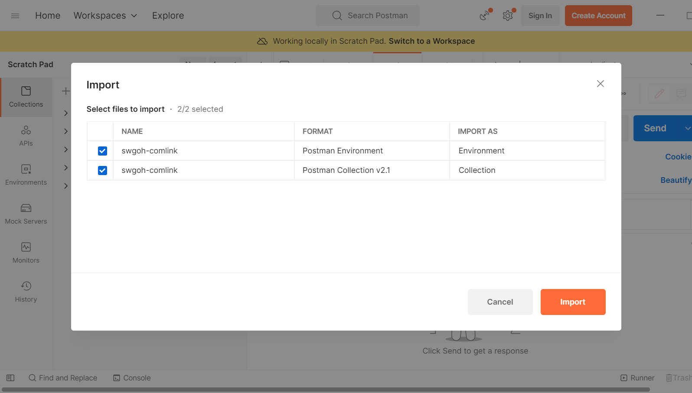

# Compatible versions of postman

Postman has moved most functionality behind a login wall in version 10, and in newer versions lacks
the ability to export/import collections directly in favor of using their cloud services.

In order to import these collections directly, you'll need to use v9 postman, which you may be able
to download
[directly from their site](https://dl.pstmn.io/download/version/9.31.30/win64), or using
[chocolatey](https://chocolatey.org/install):

```sh
choco uninstall postman -n
choco install postman --version=9.31.0
```

If prompted to update postman past v9, you should decline if you would like to be able to import and
export collections.

There may be additional information available about
[other versions](https://community.postman.com/t/direct-download-link-for-9-x/29148), and
[disabling the updater](https://stackoverflow.com/questions/77175558/postman-removed-offline-mode-scratch-pad-in-new-versions-is-there-a-way-to-en),
if you’re interested in doing that.

# Importing collections into postman in v9

To import the sample collections, open the import menu and then either drag and drop the json files
into the file tab's box, or click/tap the box to navigate to where the files are located and select
them.

Alternatively, you can use the "link" import type and directly specify the github URLs:
- [swgoh-comlink.postman_collection.json](https://raw.githubusercontent.com/swgoh-utils/swgoh-comlink/refs/heads/main/postman/swgoh-comlink.postman_collection.json)
- [swgoh-comlink.postman_environment.json](https://raw.githubusercontent.com/swgoh-utils/swgoh-comlink/refs/heads/main/postman/swgoh-comlink.postman_environment.json)




# Modifying the included sample environment

Depending on where you have deployed swgoh-comlink and how you have configured it, you will need to
tailor the included postman environment. This can be done by switching to the swgoh-comlink
environment via the widget in the top right, or via the tabs along the left side bar, selecting
swgoh-comlink as the "active" environment.

When editing the environment there are default and current values. When modifying the current
values, such as to change the port or keys, click save after the modification so that the new
values will be active.

# HMAC signing

The included collection implements the HMAC signing if the accessKey and secretKey environment
variables are set.

# Game data and localization versions

Variables are automatically populated with the response from the /metadata call using post
processing scripting. You should send a metadata call before attempting to fetch the data or
localization responses.

# Increasing the postman max response size

The game data response is larger than the default value for max response size. You will need to
increase this setting to something larger than the game data size (for example, 500 MB) in order for
postman to be able to process this request. This value is in settings as "Max response size in MB".